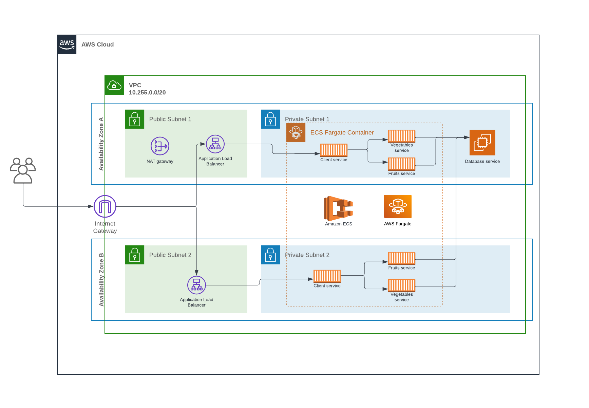

# Microservices Architecture on AWS

This repository draws inpiration from [**"Learning Live with AWS & HashiCorp"**](https://www.youtube.com/playlist?list=PL81sUbsFNc5bYnjraNpivm1XxR3WNM_Kd) series.

## The Architecture

## Getting Started

#### Prerequisites

1. Have an [AWS Account](https://aws.amazon.com/).

2. Install [HashiCorp Terraform](https://www.terraform.io/downloads).

3. Have the [AWS CLI Installed](https://docs.aws.amazon.com/cli/latest/userguide/getting-started-install.html).

4. Create an [AWS IAM User](https://docs.aws.amazon.com/IAM/latest/UserGuide/getting-started_create-admin-group.html) with required permissions.

5. [Configure the AWS CLI](https://docs.aws.amazon.com/cli/latest/userguide/cli-chap-configure.html) with the IAM User from Step 4.
  - Terraform will read your credentials via the AWS CLI 
  - Use the AWS user profile to login to AWS using Terraform

#### Using this Code

1. Clone this repo to an empty directory.

2. Create a `terraform.tfvars` file to add missing variables (optional).

3. Run `terraform plan` to see what resources will be created.

4. Run `terraform apply` to create the infrastructure on AWS!

5. Run `terraform destroy` when you're done to get rid of the infrastructure.

6. Run `terraform fmt` to format the code.

